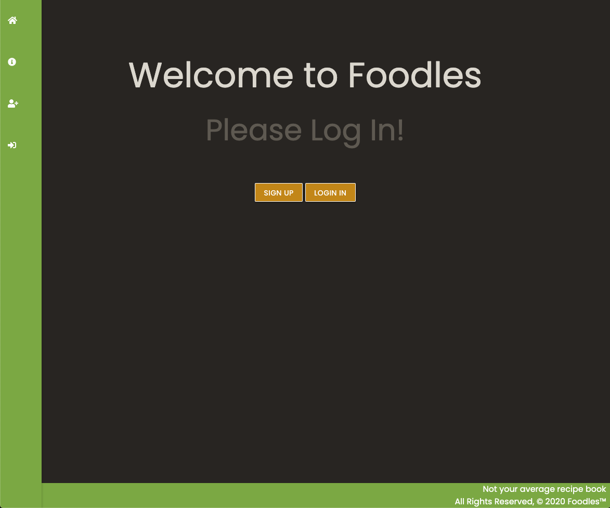
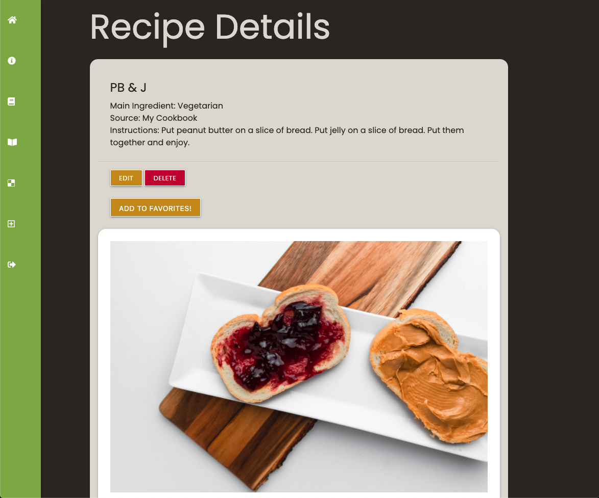

# Foodles

Foodles is a recipe app that allows you to document your culinary creations. 

# Screenshots:

# Technologies Used:

* HTML
* CSS
* Python
* Django
* PostgreSQL
* Materialize

# Getting Started:

Checkout the site here => [Foodles](https://foodles-1.herokuapp.com/)

Trello Board => [Trello](https://trello.com/b/JDDFxlNG/sei-project-3)

Pitch Deck => [Pitch-Deck](https://docs.google.com/presentation/d/1yKKEjfVX1aSrkACEob1M4n23xQz9-t-Dx92HOr4xYfc/edit#slide=id.p)

# Next Steps:

* View recipes by cuisine type
* Add search feature

